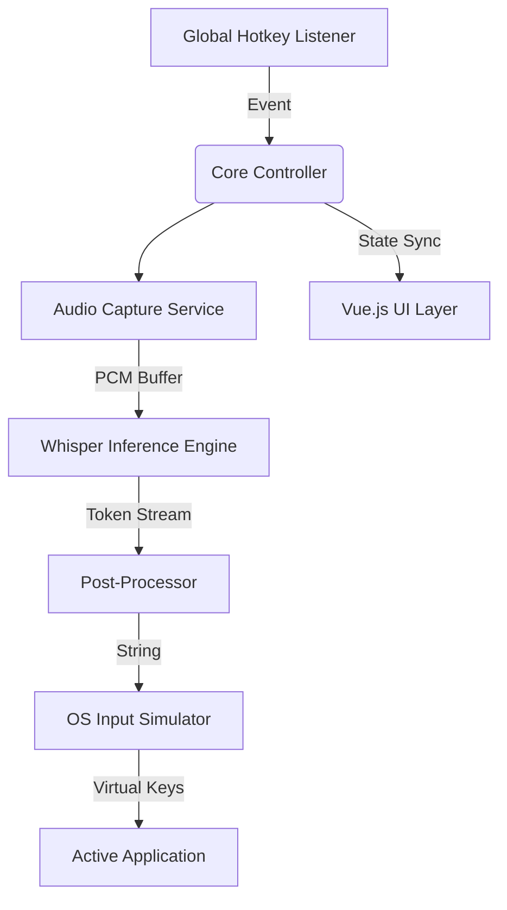

# 🌊 VibeFlow

[](https://github.com/DerJanniku/VibeFlow/actions)
[](https://opensource.org/licenses/MIT)
[](https://github.com/DerJanniku/VibeFlow/releases)

**High-Performance Voice-to-Text Transcription Suite powered by Whisper AI.**

VibeFlow is a cross-platform desktop application designed for seamless, near-instantaneous audio-to-text conversion. By leveraging OpenAI's Whisper models locally, it ensures maximum privacy and minimal latency without relying on external APIs.

---

## 🛠 Technical Stack

- **Backend:** [Rust](https://www.rust-lang.org/) (High-concurrency audio processing & system integration)
- **Frontend:** [Vue.js 3](https://vuejs.org/) + [TypeScript](https://www.typescriptlang.org/) (Reactive UI / Overlay)
- **Framework:** [Tauri](https://tauri.app/) (Memory-efficient bridge between Web & Native)
- **AI Core:** [whisper.cpp](https://github.com/ggerganov/whisper.cpp) (Optimized C++ inference via FFI)
- **OS Integration:** Low-level global hotkey hooks and simulated keyboard input.

---

## 🏗 System Architecture

VibeFlow utilizes a decoupled multi-threaded architecture to ensure the UI remains responsive even during heavy AI inference.



### Key Components:
- **Audio Capture Service:** Implemented using `cpal` for low-latency PCM data acquisition.
- **Inference Engine:** Managed via a worker-pool to utilize multi-core CPU/GPU acceleration.
- **Auto-Paste Module:** Utilizes system-level clipboard management and `enigo` for cross-platform keyboard emulation.

---

## ✨ Features

- **🚀 Global Hotkey Integration:** Instant start/stop transcription from any application.
- **🔒 Local-First Privacy:** No audio data ever leaves your machine. Processing is done entirely offline.
- **🎛 Adaptive AI Models:** Choose between four performance tiers (Tiny to Large) based on your hardware capabilities.
- **🖥 Interactive Overlay:** Real-time visual feedback of voice activity levels and transcription status.
- **⚙️ Dynamic Configuration:** Custom hotkeys, auto-start, and model management.

---

## 🚀 Getting Started

### Prerequisites
- **Node.js** 20.x or higher
- **Rust** 1.77.x or higher (stable)
- **C++ Build Tools** (for optimized inference libraries)

### Installation (Development)
```bash
# Clone the repository
git clone https://github.com/DerJanniku/VibeFlow.git
cd VibeFlow

# Install frontend dependencies
cd ui && npm install && cd ..

# Run development server
npm run dev
```

### Building for Production
```bash
# Cross-platform build via Tauri
cargo tauri build
```

---

## 🤝 Contributing

Contributions are welcome! We follow a strict coding standard to maintain high performance and readability.

1. Fork the Project
2. Create your Feature Branch (`git checkout -b feature/AmazingFeature`)
3. Commit your Changes (`git commit -m 'feat: add amazing feature'`)
4. Push to the Branch (`git push origin feature/AmazingFeature`)
5. Open a Pull Request

---

<p align="center">
  <b>Developed with precision by DerJanniku</b><br>
  <i>Focusing on performance, privacy, and user experience.</i>
</p>
