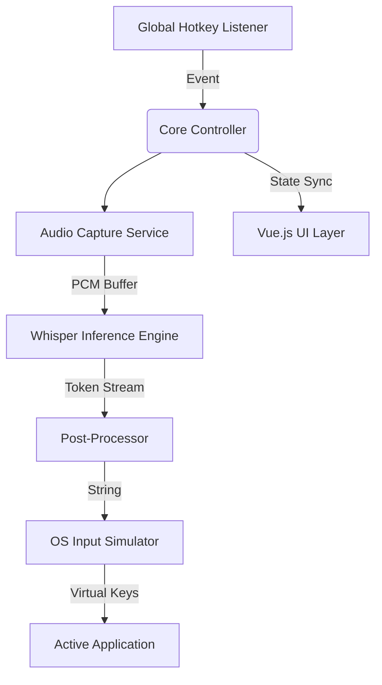

# 🌊 VibeFlow

<<<<<<< HEAD
[](https://github.com/DerJanniku/VibeFlow/actions)
[](https://opensource.org/licenses/MIT)
[](https://github.com/DerJanniku/VibeFlow/releases)

**High-Performance Voice-to-Text Transcription Suite powered by Whisper AI.**

VibeFlow is a cross-platform desktop application designed for seamless, near-instantaneous audio-to-text conversion. By leveraging OpenAI's Whisper models locally, it ensures maximum privacy and minimal latency without relying on external APIs.

---

## 🛠 Technical Stack

- **Backend:** [Rust](https://www.rust-lang.org/) (High-concurrency audio processing & system integration)
- **Frontend:** [Vue.js 3](https://vuejs.org/) + [TypeScript](https://www.typescriptlang.org/) (Reactive UI / Overlay)
- **Framework:** [Tauri](https://tauri.app/) (Memory-efficient bridge between Web & Native)
- **AI Core:** [whisper.cpp](https://github.com/ggerganov/whisper.cpp) (Optimized C++ inference via FFI)
- **OS Integration:** Low-level global hotkey hooks and simulated keyboard input.

---

## 🏗 System Architecture

VibeFlow utilizes a decoupled multi-threaded architecture to ensure the UI remains responsive even during heavy AI inference.



### Key Components:
- **Audio Capture Service:** Implemented using `cpal` for low-latency PCM data acquisition.
- **Inference Engine:** Managed via a worker-pool to utilize multi-core CPU/GPU acceleration.
- **Auto-Paste Module:** Utilizes system-level clipboard management and `enigo` for cross-platform keyboard emulation.
=======
[](https://opensource.org/licenses/MIT)
[](#)
[](#)
[](#)

**Voice-to-Text Transcription Powered by Whisper AI**
A professional, privacy-focused transcription tool that runs entirely on your local machine.

[Changelog](CHANGELOG.md) | [License](LICENSE) | [Security](SECURITY.md)

---

### ⚠️ Development Status
**VibeFlow is currently in active development.**
- **Current Stable Version:** `v0.3.3` (This is currently the only version that runs reliably).
- **Supported Platforms:**
    - **Windows:** 10/11 (Primary, optimized experience).
    - **Linux:** Experimental Beta (Supports X11 & Wayland).
    - **macOS:** Planned.

---

## 🛠️ The Local AI Stack

VibeFlow is built with a commitment to privacy and performance:

- **Frontend:** Vue.js 3 + Vite (Apple-inspired Cyberpunk UI)
- **Core:** Rust (Tauri 2.0)
- **Inference:** `whisper-rs` (Local Whisper AI)
- **Refinement:** Local Ollama integration
- **Audio:** `cpal` for high-performance low-latency audio capture
>>>>>>> origin/master

---

## ✨ Features

<<<<<<< HEAD
- **🚀 Global Hotkey Integration:** Instant start/stop transcription from any application.
- **🔒 Local-First Privacy:** No audio data ever leaves your machine. Processing is done entirely offline.
- **🎛 Adaptive AI Models:** Choose between four performance tiers (Tiny to Large) based on your hardware capabilities.
- **🖥 Interactive Overlay:** Real-time visual feedback of voice activity levels and transcription status.
- **⚙️ Dynamic Configuration:** Custom hotkeys, auto-start, and model management.

---

## 🚀 Getting Started

### Prerequisites
- **Node.js** 20.x or higher
- **Rust** 1.77.x or higher (stable)
- **C++ Build Tools** (for optimized inference libraries)

### Installation (Development)
```bash
# Clone the repository
git clone https://github.com/DerJanniku/VibeFlow.git
cd VibeFlow

# Install frontend dependencies
cd ui && npm install && cd ..

# Run development server
npm run dev
```

### Building for Production
```bash
# Cross-platform build via Tauri
cargo tauri build
```
=======
- **Real-time Transcription** - Press a hotkey (Default: `Ctrl + Shift + Space`) and speak. Your words appear instantly.
- **Privacy First** - Powered by **Whisper AI** running locally. Your voice data never leaves your computer.
- **AI Refinement** - Optionally uses **Ollama** (locally) to correct grammar and formatting based on the application you are using (Coding, Chat, Browser, etc.).
- **Smart Context** - Automatically detects if you are in a Code Editor, Terminal, or Chat app and adjusts the text style accordingly.
- **Dynamic Overlay** - A sleek, cyberpunk-inspired visualizer shows your audio amplitude in real-time.
- **System Tray** - Runs quietly in the background, always ready.
- **Auto-Paste** - Transcribed text is automatically pasted into the text field you are currently in.

---

## 🚀 Quick Start (v0.3.3)

### Windows
1. Download the latest release from the [Releases](https://github.com/DerJanniku/VibeFlow/releases) page.
2. Run `vibeflow.exe`.
3. Complete the onboarding to download the AI models (stored in `%APPDATA%/com.vibeflow.app`).
4. Press `Ctrl + Shift + Space` (default) to start/stop transcribing!

---

## ⌨️ Hotkeys

| Action | Hotkey |
| :--- | :--- |
| **Start/Stop Recording** | `Ctrl + Shift + Space` |
| **Customization** | Change in Settings UI |

---

## 🛠️ Build from Source (Windows)

### Prerequisites
- [Node.js 20+](https://nodejs.org/)
- [Rust 1.77+](https://rustup.rs/)
- [Tauri CLI 2.0](https://tauri.app/)

### Steps
1. **Clone the repo**
   ```bash
   git clone https://github.com/DerJanniku/VibeFlow.git
   cd VibeFlow
   ```

2. **Install UI dependencies**
   ```bash
   cd ui
   npm install
   cd ..
   ```

3. **Install Core dependencies**
   ```bash
   npm install
   ```

4. **Run in Development Mode**
   ```bash
   npm run dev
   ```

5. **Build for Production**
   ```bash
   npm run build
   ```

---

## 📁 Project Structure

- `src-tauri/` - Rust backend (Core logic, Audio, Inference).
- `ui/` - Vue.js 3 frontend (Settings, Overlay, Onboarding).
- `scripts/` - Automation scripts for setup and shortcuts.
>>>>>>> origin/master

---

## 🤝 Contributing

<<<<<<< HEAD
Contributions are welcome! We follow a strict coding standard to maintain high performance and readability.

1. Fork the Project
2. Create your Feature Branch (`git checkout -b feature/AmazingFeature`)
3. Commit your Changes (`git commit -m 'feat: add amazing feature'`)
=======
Contributions are welcome! Whether it's reporting a bug, suggesting a feature, or submitting a pull request, your help is appreciated.

1. Fork the Project
2. Create your Feature Branch (`git checkout -b feature/AmazingFeature`)
3. Commit your Changes (`git commit -m 'Add some AmazingFeature'`)
>>>>>>> origin/master
4. Push to the Branch (`git push origin feature/AmazingFeature`)
5. Open a Pull Request

---

<<<<<<< HEAD
<p align="center">
  <b>Developed with precision by DerJanniku</b><br>
  <i>Focusing on performance, privacy, and user experience.</i>
</p>
=======
## 📄 License

This project is licensed under the **MIT License** - see the [LICENSE](LICENSE) file for details.

---

*Made with ❤️ by [DerJannik](https://de.fiverr.com/s/xXgY29x)*
>>>>>>> origin/master
